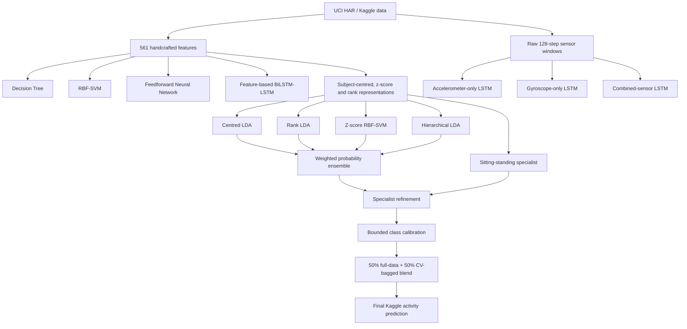

# Methodology

## 1. Project objective

This project develops a multiclass Human Activity Recognition (HAR) system using smartphone accelerometer and gyroscope measurements. The objective is to classify each observation into one of six activities:

1. `LAYING`
2. `SITTING`
3. `STANDING`
4. `WALKING`
5. `WALKING_DOWNSTAIRS`
6. `WALKING_UPSTAIRS`

The work compares traditional machine-learning baselines, a feedforward neural network, recurrent neural networks, sensor-ablation models, and a subject-normalised hierarchical ensemble. Multiclass **Macro F1-score** was treated as the primary model-selection metric because it gives equal importance to all six activity classes.

---

## 2. Dataset and input representations

The experiments used the UCI Human Activity Recognition Using Smartphones dataset and the corresponding Kaggle competition files.

Two input representations were evaluated.

### 2.1 Handcrafted feature vectors

Each observation contains **561 engineered time- and frequency-domain features** extracted from smartphone accelerometer and gyroscope signals. The competition training file contains 7,352 labelled observations, a subject identifier, and the activity label. The competition test file contains 2,947 unlabelled observations.

Examples of the engineered variables include:

- body-acceleration statistics;
- total-acceleration statistics;
- body-gyroscope statistics;
- jerk and magnitude measurements;
- frequency-domain measurements; and
- orientation-angle features.

### 2.2 Raw time-series windows

For the sequence-modelling and sensor-contribution experiments, each observation was represented as a raw window with:

- **128 time steps**; and
- **9 sensor channels**.

The nine channels were:

- `body_acc_x`, `body_acc_y`, `body_acc_z`;
- `body_gyro_x`, `body_gyro_y`, `body_gyro_z`; and
- `total_acc_x`, `total_acc_y`, `total_acc_z`.

---

## 3. Experimental overview

The following models were implemented and evaluated:

| Model | Input | Main purpose |
|---|---|---|
| Default Decision Tree | 561 handcrafted features | Initial interpretable baseline |
| Tuned Decision Tree | 561 handcrafted features | Improved tree baseline using grid search |
| Default RBF-SVM | 561 standardised features | Non-linear traditional baseline |
| Tuned SVM | 561 standardised features | Hyperparameter-optimised traditional model |
| Feedforward Neural Network | 561 standardised features | Neural-network comparison on handcrafted features |
| Feature-based BiLSTM-LSTM | 561 features reshaped as a sequence | Recurrent processing of the feature vector |
| Accelerometer-only raw-signal LSTM | Raw `128 x 6` sequence | Measure accelerometer contribution |
| Gyroscope-only raw-signal LSTM | Raw `128 x 3` sequence | Measure gyroscope contribution |
| Combined-sensor raw-signal LSTM | Raw `128 x 9` sequence | End-to-end sequence learning using both sensors |
| Centred-feature LDA | Subject-centred features | Final ensemble component |
| Rank-feature LDA | Within-subject rank features | Final ensemble component |
| Subject-z-score RBF-SVM | Subject-z-scored features | Final ensemble component |
| Hierarchical LDA | Subject-normalised features | Static/dynamic hierarchical classification |
| Sitting-versus-standing LDA | Within-subject rank features | Specialist classifier for the most confused pair |
| Subject-Normalised Hierarchical Ensemble | Combined probabilities | Final Kaggle submission model |

No GRU model was used in the supplied implementation; the recurrent experiments used LSTM-based architectures.

---

## 4. Preprocessing for handcrafted-feature models

The original competition training data had 7,352 rows and 563 columns: 561 predictive features, one subject column, and one activity-label column.

The following preprocessing procedure was used for the initial feature-based experiments:

1. The activity label and subject identifier were separated from the 561 predictive features.
2. The data were divided into an 80% training set and a 20% validation set:
   - training: 5,881 observations;
   - validation: 1,471 observations.
3. A `StandardScaler` was fitted using only the training features.
4. The fitted scaler was used to transform both the training and validation features.
5. The same saved scaler was applied to the Kaggle test features without refitting.
6. Activity labels were preserved as uppercase class names for classical models and label-encoded for neural-network models.

Fitting the scaler only on the training partition prevented validation information from influencing the preprocessing parameters.

---

## 5. Traditional machine-learning baselines

### 5.1 Decision Tree

A Decision Tree classifier was used as the first interpretable baseline. Both a default model and a tuned model were evaluated.

The tuned model was selected using five-fold `GridSearchCV`. Thirty hyperparameter combinations were tested, covering tree-complexity and node-splitting settings. The selected configuration was:

- criterion: `entropy`;
- maximum depth: `10`; and
- minimum samples required to split a node: `5`.

The model was evaluated using accuracy, per-class precision, per-class recall, per-class F1-score, Macro F1-score, and a confusion matrix.

### 5.2 Support Vector Machine

A Support Vector Machine was trained on the same standardised 561-feature representation.

Two SVM settings were evaluated:

1. **Default RBF-SVM**
   - kernel: `rbf`;
   - `C = 1.0`; and
   - gamma: `scale`.

2. **Tuned SVM**
   - linear kernels with `C` in `{0.1, 1, 10}`; and
   - RBF kernels with `C` in `{0.1, 1, 10}` and gamma in `{scale, auto}`.

Five-fold `GridSearchCV` was performed on the training partition using `f1_macro` as the scoring function. The selected model used:

- kernel: `rbf`;
- `C = 10`; and
- gamma: `scale`.

The RBF kernel was used to capture non-linear decision boundaries between the six activities.

---

## 6. Feedforward Neural Network

A Feedforward Neural Network (FNN) was trained using the same 561 standardised handcrafted features as the traditional baselines.

The implemented architecture was:

```text
Input: 561 features
    -> Dense(128, ReLU)
    -> Dropout(0.30)
    -> Dense(64, ReLU)
    -> Dropout(0.30)
    -> Dense(6, Softmax)
```

Training configuration:

- optimiser: Adam;
- loss function: categorical cross-entropy;
- epochs: 50;
- batch size: 32; and
- validation data: the shared 20% validation partition.

The labels were converted to integer class IDs and then one-hot encoded. Standardised inputs controlled differences in feature scale, while dropout regularisation reduced co-adaptation and overfitting. The supplied FNN notebook contains the final two-hidden-layer architecture above; it does not contain a separate controlled depth-ablation experiment, so no additional depth results are claimed here.

---

## 7. Feature-based recurrent model

A recurrent model was also trained using the 561 handcrafted features. Each feature vector was reshaped from `(561,)` to `(561, 1)` so that it could be processed by recurrent layers.

The architecture was:

```text
Input: 561 x 1
    -> Bidirectional LSTM(128, return_sequences=True)
    -> Dropout(0.30)
    -> LSTM(64)
    -> Dropout(0.30)
    -> Dense(128, ReLU)
    -> Dropout(0.30)
    -> Dense(6, Softmax)
```

Training configuration:

- optimiser: Adam;
- loss function: categorical cross-entropy;
- maximum epochs: 100;
- batch size: 16;
- early stopping on validation loss with patience 10;
- learning-rate reduction on validation loss with factor 0.5 and patience 3; and
- model checkpointing using validation accuracy.

This experiment tested recurrent processing on the engineered feature representation. However, the ordering of the 561 features is not a true chronological sequence, so this model was treated separately from the raw-signal sequence experiment.

---

## 8. Raw-signal LSTM and sensor-ablation experiments

The problem was reformulated as sequence classification by using the original 128-step inertial-signal windows. Three controlled experiments were performed with the same architecture and training procedure. Only the selected sensor channels changed.

### 8.1 Sensor configurations

| Experiment | Channels | Input shape |
|---|---|---:|
| Accelerometer only | Body acceleration XYZ and total acceleration XYZ | `128 x 6` |
| Gyroscope only | Body gyroscope XYZ | `128 x 3` |
| Combined sensors | All accelerometer and gyroscope channels | `128 x 9` |

### 8.2 Raw-signal normalisation

For each experiment, one mean and one standard deviation were calculated for each selected channel using only the official UCI training partition. The same channel statistics were then applied to the official UCI test partition:

\[
X' = \frac{X - \mu_{train}}{\sigma_{train}}
\]

A near-zero standard deviation was replaced by 1.0 to avoid division by zero.

### 8.3 Fixed LSTM architecture

All three sensor configurations used the same model:

```text
Input: 128 x number_of_channels
    -> Bidirectional LSTM(128, return_sequences=True)
    -> Dropout(0.30)
    -> LSTM(64)
    -> Dropout(0.30)
    -> Dense(128, ReLU)
    -> Dropout(0.30)
    -> Dense(6, Softmax)
```

Training configuration:

- optimiser: Adam with learning rate `0.001`;
- loss function: categorical cross-entropy;
- maximum epochs: 60;
- batch size: 64;
- early stopping on validation loss with patience 8;
- learning-rate reduction by a factor of 0.5;
- minimum learning rate: `1e-6`;
- best-model checkpointing on validation loss; and
- random seed: 42.

The official labelled UCI training and test partitions were used for this extended-task comparison. The test partition was supplied to the training routine as validation data for early stopping and was also used for the reported sensor-comparison metrics. Therefore, these results were interpreted as an internal sensor-ablation experiment and were not treated as directly equivalent to the final subject-wise out-of-fold evaluation.

---

## 9. Final Subject-Normalised Hierarchical Ensemble

The final Kaggle submission used all 561 handcrafted features and explicitly modelled participant-level variation. It did not use the hidden Kaggle test labels.

### 9.1 Subject-normalised representations

Three representations were generated independently within each subject, without using activity labels.

#### Subject-centred features

\[
X_{centered} = X - \mu_{subject}
\]

This removes each subject's feature-wise mean.

#### Subject z-score features

\[
X_{zscore} = \frac{X - \mu_{subject}}{\sigma_{subject}}
\]

This adjusts both the location and scale of each feature within a subject. Standard deviations below `1e-6` were replaced by 1.0.

#### Within-subject rank features

Each feature value was converted to its percentile rank within the corresponding subject and mapped to `[-1, 1]`:

\[
X_{rank} = 2 \times percentile\_rank(X) - 1
\]

This representation reduces sensitivity to feature magnitude and extreme values.

### 9.2 Subject-wise cross-validation

The final model used five-fold `GroupKFold`, with the subject identifier as the grouping variable. Consequently, no participant appeared in both the training and validation portions of the same fold.

For every fold, the model generated:

- out-of-fold probabilities for the validation subjects; and
- test probabilities that were averaged across folds to form a cross-validation-bagged prediction.

### 9.3 Ensemble components

#### A. Centred-feature LDA

A shrinkage Linear Discriminant Analysis model was trained on subject-centred features.

#### B. Rank-feature LDA

A second shrinkage LDA model was trained on within-subject rank features.

#### C. Subject-z-score RBF-SVM

An RBF-SVM was trained on subject-z-scored features using:

- `C = 3.0`;
- gamma: `scale`; and
- probability estimation enabled.

#### D. Hierarchical LDA

The hierarchical model decomposed the six-class problem into two stages.

**Stage 1: activity-group classification**

- static group: `LAYING`, `SITTING`, `STANDING`;
- dynamic group: `WALKING`, `WALKING_DOWNSTAIRS`, `WALKING_UPSTAIRS`.

A shrinkage LDA classifier predicted the probability of the static or dynamic group using subject-z-scored features.

**Stage 2: within-group classification**

- the dynamic classifier used within-subject rank features;
- the static classifier used subject-z-scored features.

The final probability for an activity was calculated by multiplying its conditional within-group probability by the probability of its parent group.

#### E. Sitting-versus-standing specialist

A binary shrinkage LDA model was trained on within-subject rank features using only `SITTING` and `STANDING` observations. Its conditional probabilities were blended with the ensemble's sitting/standing probabilities while preserving the total probability mass assigned to that pair.

### 9.4 LDA configuration

All LDA components used:

- solver: `lsqr`; and
- shrinkage: `0.003`.

### 9.5 Ensemble-weight selection

The four principal model probabilities were blended using non-negative weights that summed to one. The weights were selected by a simplex search using only out-of-fold training predictions, with a search step of 0.10.

The selected blend was:

\[
P_{ensemble} =
0.30P_{centered\_LDA}
+0.10P_{rank\_LDA}
+0.20P_{zscore\_SVM}
+0.40P_{hierarchical\_LDA}
\]

### 9.6 Sitting-standing probability refinement

The sitting-versus-standing specialist blending coefficient was selected from out-of-fold predictions. The selected value was:

\[
\alpha = 0.12
\]

The refined conditional probability was:

\[
P_{pair}^{refined} =
(1-\alpha)P_{pair}^{ensemble}
+\alpha P_{pair}^{specialist}
\]

### 9.7 Bounded class-factor calibration

A bounded coordinate search was performed on the out-of-fold probabilities to improve Macro F1. Candidate class factors were restricted to the range `[0.85, 1.15]`, searched in steps of 0.01 for up to three passes. Calibration was retained only when it improved out-of-fold Macro F1.

The selected factors were:

| Activity | Factor |
|---|---:|
| LAYING | 1.00 |
| SITTING | 1.12 |
| STANDING | 1.02 |
| WALKING | 0.94 |
| WALKING_DOWNSTAIRS | 1.00 |
| WALKING_UPSTAIRS | 0.93 |

After applying the factors, the probabilities were renormalised so that each row summed to one.

### 9.8 Final full-data and cross-validation blend

After selecting the ensemble settings, all model components were retrained on the complete labelled training dataset. Two sets of test probabilities were produced:

1. probabilities from models trained on all labelled training data; and
2. probabilities averaged across the five cross-validation folds.

The primary Kaggle prediction used an equal blend:

\[
P_{final} = 0.50P_{full} + 0.50P_{CV-bagged}
\]

The class with the maximum final probability was selected as the predicted activity. Full-only and cross-validation-bagged submission files were also saved as alternatives.

---

## 10. Validation protocols

Because the project evolved through several stages, different experiments used different validation protocols.

| Experiment group | Validation approach |
|---|---|
| Decision Tree | Shared 80:20 train-validation split; five-fold grid search on training data |
| SVM | Shared 80:20 train-validation split; five-fold grid search on training data |
| Feedforward Neural Network | Shared 80:20 train-validation split |
| Feature-based BiLSTM-LSTM | Shared 80:20 train-validation split with early stopping |
| Raw-signal sensor experiments | Official labelled UCI train/test partitions; test partition used as validation/evaluation data |
| Final ensemble | Five-fold GroupKFold by subject with zero subject overlap |

Scores produced under these different protocols were not treated as strictly interchangeable. The final ensemble's subject-wise out-of-fold evaluation was considered the strongest estimate of generalisation to unseen participants.

---

## 11. Evaluation metrics

All models were evaluated using some or all of the following metrics:

- accuracy;
- precision for each class;
- recall for each class;
- F1-score for each class;
- Macro Precision;
- Macro Recall;
- Macro F1-score;
- Weighted F1-score; and
- confusion matrix.

For class `c`:

\[
Precision_c = \frac{TP_c}{TP_c + FP_c}
\]

\[
Recall_c = \frac{TP_c}{TP_c + FN_c}
\]

\[
F1_c = 2 \times \frac{Precision_c \times Recall_c}{Precision_c + Recall_c}
\]

The competition metric was the unweighted mean of the six class-specific F1-scores:

\[
Macro\ F1 = \frac{1}{6}\sum_{c=1}^{6}F1_c
\]

Macro F1 was prioritised during Decision Tree and SVM tuning, ensemble-weight selection, specialist blending, and class-factor calibration.

---

## 12. Reproducibility and leakage controls

The following practices were used to improve reproducibility and reduce leakage:

- training-derived scalers were applied to validation and test data without refitting;
- raw-signal means and standard deviations were calculated from training data only;
- subject normalisation used no activity labels;
- final ensemble hyperparameters and probability weights were selected from out-of-fold training predictions;
- GroupKFold ensured zero subject overlap in final validation;
- fixed random seeds were used where implemented; and
- the hidden Kaggle test labels were not used.

A methodological limitation is that the official labelled UCI test partition was used as validation data during the raw-signal LSTM training. A future version should create a separate subject-wise validation partition from the UCI training subjects and reserve the official test partition for a single final evaluation.

---

## 13. Implementation files

The methodology corresponds to the following project files:

- Member 1 Decision Tree preprocessing, tuning notes, scaler, and trained model;
- `member 2/run_all.py` for the default and tuned SVM experiments;
- `member 3/member3_fnn.ipynb` for the Feedforward Neural Network;
- `member 4/train_lstm.py` for the feature-based BiLSTM-LSTM;
- `member 5/Extended_task_LSTM.ipynb` for raw-signal sequence learning and sensor ablation; and
- `subject-normalized-hierarchical-ensemble.ipynb` for the final Kaggle submission.

---

## 14. Complete workflow



---

## 15. Methodology summary

The study began with Decision Tree and SVM baselines on the 561 handcrafted features, followed by an FNN using the same representation. Recurrent learning was investigated first by reshaping the engineered features and then by modelling the genuine 128-step raw sensor windows. Accelerometer-only, gyroscope-only, and combined-sensor LSTMs were trained under a controlled architecture to measure sensor contribution. The final Kaggle system used subject-centred, subject-z-scored, and within-subject-rank representations with LDA, RBF-SVM, hierarchical classification, a sitting-standing specialist, out-of-fold probability optimisation, and a full-data/CV-bagged probability blend.
